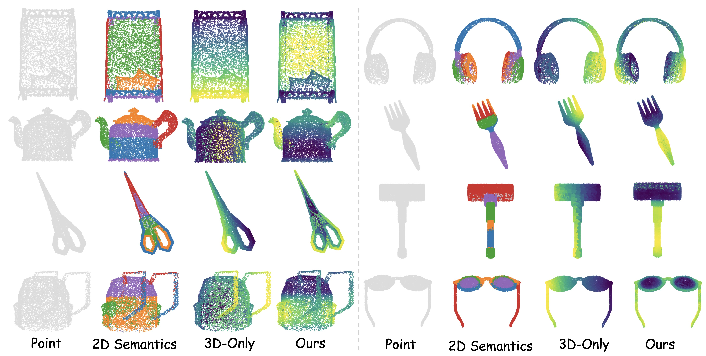
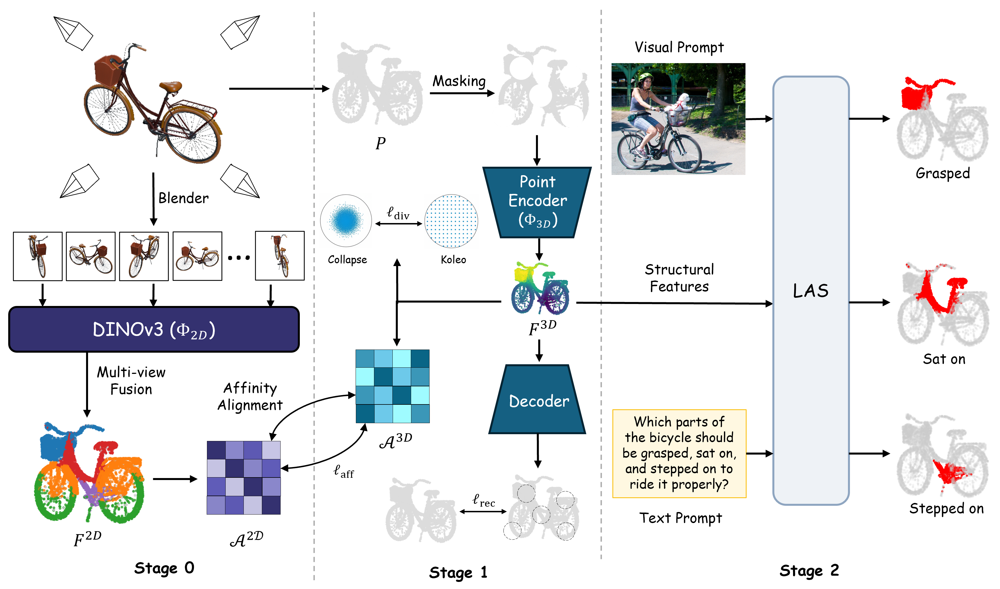
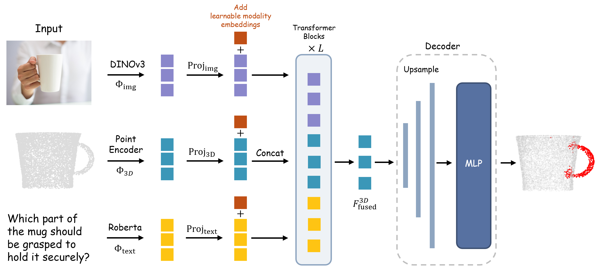
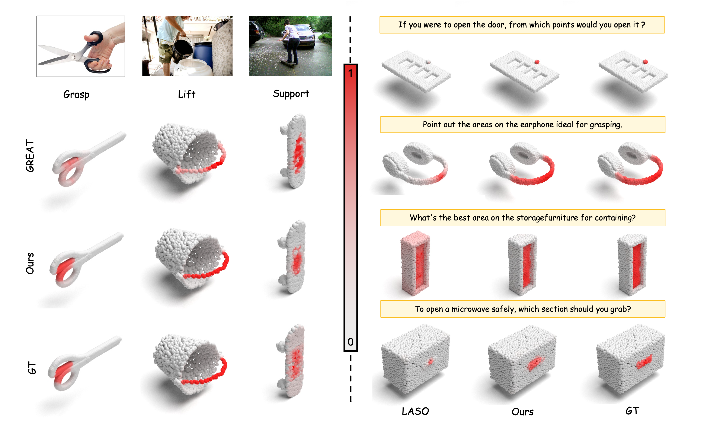
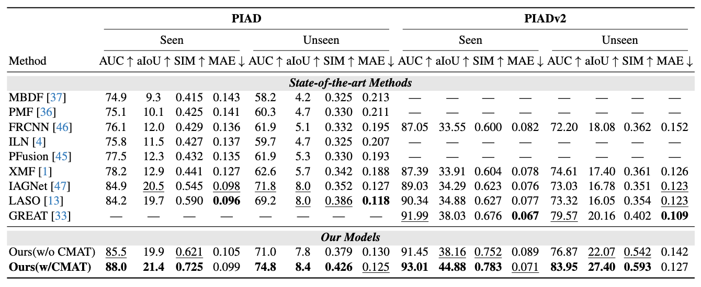
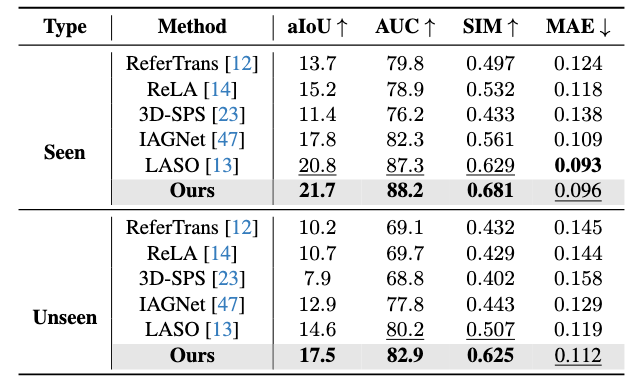

# Unlocking 3D Affordance Segmentation with 2D Semantic Knowledge

<p align="center">
    
</p>

This repository contains the official code for **CMAT** and **LAS**, accepted by **CVPR 2026**.

The project is organized as a 3-stage pipeline:

1. **Stage 0: 2D semantic knowledge extraction** in `unsup-affordance/`
2. **Stage 1: cross-modal affinity transfer pretraining** in `Point-MAE/`
3. **Stage 2: prompt-conditioned affordance segmentation (LAS)** in the project root

At the repository root, the main entry point is `train.py`, which trains the downstream **LAS** model on **PIAD**, **PIADv2**, or **LASO**.

## Abstract

Affordance segmentation aims to decompose 3D objects into parts that serve distinct functional roles, enabling models to reason about object interactions rather than mere recognition. Existing methods, mostly following the paradigm of 3D semantic segmentation or prompt-based frameworks, struggle when geometric cues are weak or ambiguous, as sparse point clouds provide limited functional information. To overcome this limitation, we leverage the rich semantic knowledge embedded in large-scale 2D Vision Foundation Models (VFMs) to guide 3D representation learning through a cross-modal alignment mechanism. Specifically, we propose Cross-Modal Affinity Transfer (CMAT), a pretraining strategy that compels the 3D encoder to align with the semantic structures induced by lifted 2D features. CMAT is driven by a core affinity alignment objective, supported by two auxiliary losses, geometric reconstruction and feature diversity, which together encourage structured and discriminative feature learning. Built upon the CMAT-pretrained backbone, we employ a lightweight affordance segmentor that injects text or visual prompts into the learned 3D space through an efficient cross-attention interface, enabling dense and prompt-aware affordance prediction while preserving the semantic organization established during pretraining. Extensive experiments demonstrate consistent improvements over previous state-of-the-art methods in both accuracy and efficiency.

## Pipeline Overview

Stage 0 associates each point cloud `P` with multi-view 2D features extracted by a frozen 2D encoder `Phi_2D`, producing lifted per-point semantic features `F_2D` and the corresponding affinity structure.

Stage 1 pretrains the 3D backbone `Phi_3D` by aligning the structural relations of 3D features with the 2D-induced affinity exported from stage 0.

Stage 2 uses the **Lightweight Affordance Segmentor (LAS)** to fine-tune the pretrained 3D encoder with either:

- **visual prompts** on `PIAD` / `PIADv2`
- **text prompts** on `LASO`

The final output is a dense prompt-conditioned affordance mask over the point cloud.

<p align="center">
    
</p>

<p align="center">
    
</p>

## What Is Included

```text
CMAT/
├── train.py                  # Stage-2 LAS training entry
├── configs/                  # LAS configs for PIAD / PIADv2 / LASO
├── data/                     # Dataset loaders
├── models/                   # LAS model, prompt encoders, Point-MAE wrapper
├── utils/                    # Metrics, logging, checkpoint helpers
├── Point-MAE/                # Stage-1 CMAT pretraining code
├── unsup-affordance/         # Stage-0 data generation / 2D-to-3D fusion code
└── figures/                  # README assets
```

## Visualizations

<p align="center">
    
</p>

## Results

- Comparison with recent vision baselines on `PIAD`, `PIADv2`, and `LASO`

<p align="center">
    
</p>

<p align="center">
    
</p>

## Environment and Requirements

We recommend using **Python 3.9 or 3.10** with a CUDA-enabled PyTorch installation.

### 1. Install PyTorch first

Please install `torch` and `torchvision` by following the official instructions for your CUDA version:

- [PyTorch installation guide](https://pytorch.org/get-started/locally/)

For example:

```bash
pip install torch torchvision
```

### 2. Install repository dependencies

```bash
pip install -r requirements.txt
```

The root `requirements.txt` covers:

- core LAS training dependencies
- common utilities needed by the repository
- optional packages used by stage 0 / stage 1 modules

### 3. Prepare external pretrained weights / models

Before running LAS training, update the paths in your config file.

Required or commonly used assets are:

- `pointmae/pretrain.pth`: Point-MAE pretrained checkpoint used by LAS
- `roberta_base/` (optional): local RoBERTa model for LASO text prompts
- `dinov3/` plus DINOv3 weights (optional): local DINOv3 repository and checkpoint

Notes:

- `configs/las_visual_config.yaml` uses `dinov2_vitb14` and can download weights through HuggingFace.
- `configs/las_laso_config.yaml` can use HuggingFace `roberta-base`, or a local folder specified by `model.text_encoder.local_model_path`.
- `configs/las_piad_config.yaml` and `configs/las_config.yaml` are configured for **local DINOv3** and therefore require both `dino_local_repo` and `dino_local_weights_name`.

## Dataset and Data Format

This repository uses different data formats for the three stages.

### Stage 0 Output

The trimmed `unsup-affordance/` module writes fused 3D artifacts back into HDF5 files, including:

- `fused_points`
- `fused_point_colors`
- `fused_features`
- `fused_feature_weights`
- `cluster_labels`
- `cluster_color_names`
- `cluster_feature_means`
- `cluster_point_similarities`

These artifacts are used to construct the stage-1 input.

### Stage 1 Input Format

`Point-MAE/` expects a directory of `.h5` files. Each instance group should contain:

- `cluster_points`: `float32`, shape `[N, 3]`
- `cluster_labels`: `int32` or `int64`, shape `[N]`
- `cluster_features`: `float32`, shape `[N, D]` for CMAT structural alignment

Example layout:

```text
stage1_h5_root/
├── category_a.h5
├── category_b.h5
└── ...
```

Inside each H5 file:

```text
category_a.h5
├── instance_000000/
│   ├── cluster_points
│   ├── cluster_labels
│   └── cluster_features
├── instance_000001/
│   ├── cluster_points
│   ├── cluster_labels
│   └── cluster_features
└── ...
```

### Stage 2 LAS Datasets

The root-level `train.py` supports three dataset types:

- `piad`
- `piadv2`
- `laso`

The dataloader behavior is controlled by `dataset_type` in the config file.

### PIAD Format

Expected root structure:

```text
Data/PIAD/Seen_or_Unseen/
├── Point_Train.txt
├── Point_Test.txt
├── Img_Train.txt
├── Img_Test.txt
├── Box_Train.txt
└── Box_Test.txt
```

Each `.txt` file is a **list file**, one path per line. Paths may be absolute or relative.

- `Img_*.txt`: image file list
- `Box_*.txt`: JSON annotation file list, aligned one-to-one with the image list
- `Point_*.txt`: point-cloud annotation file list

Typical image path pattern:

```text
.../Img/Train/<ObjectName>/<AffordanceName>/xxx.jpg
```

Typical box JSON content:

- `shapes[*].label == "subject"` for the subject box
- `shapes[*].label == "object"` for the object box

Point file format:

```text
idx0 idx1 x y z m1 m2 ... m17
```

Where:

- the first two fields are ignored by the loader
- `x y z` are point coordinates
- the remaining 17 values are binary or soft affordance labels

During loading:

- the affordance channel is selected from the image path name
- the point cloud is sampled or padded to `num_points`
- points are normalized to a unit sphere

### PIADv2 Format

Expected root structure:

```text
Data/PIADv2/<split_name>/
├── Point_train.txt
├── Point_test.txt
├── Img_train.txt
└── Img_test.txt
```

The loader also accepts uppercase legacy names such as `Point_Train.txt` and `Img_Test.txt`.

Each list file contains one image or point path per line.

Typical path pattern:

```text
.../<ObjectName>/<InstanceName>/<AffordanceName>/xxx
```

Point files are stored as `.npy` arrays with layout:

```text
[x, y, z, mask...]
```

More precisely:

- columns `0:3` are interpreted as xyz coordinates
- columns `3:` are interpreted as the ground-truth mask tensor

In the common visual-prompt setting, each `.npy` file is typically paired with one affordance/image sample and `data[:, 3:]` corresponds to the mask to be predicted for that sample.

During loading:

- training uses dynamic image-point pairing within the same object class and affordance
- test mode assumes the image list and point list are aligned by index
- the point cloud is resampled to `num_points`

### LASO Format

Expected root structure:

```text
Data/LASO_dataset/
├── anno_train.pkl
├── anno_val.pkl
├── anno_test.pkl
├── objects_train.pkl
├── objects_val.pkl
├── objects_test.pkl
└── Affordance-Question.csv
```

`anno_<split>.pkl` should be a list of annotation dictionaries. Each item is expected to contain:

- `shape_id`
- `class`
- `affordance`
- `mask`

`objects_<split>.pkl` should be a dictionary mapping `shape_id` to point clouds:

- value shape: `[N, 3]`

`Affordance-Question.csv` provides textual prompts and should contain at least:

- `Object`
- `Affordance`
- `Question0`

Optional additional prompt columns such as `Question1` to `Question14` are also supported.

During loading:

- the loader selects a question template based on object and affordance
- point clouds are normalized and sampled to `num_points`
- evaluation can be filtered into `seen` and `unseen` subsets

## Configuration

Main configs:

- `configs/las_visual_config.yaml`: visual-prompt LAS on `PIADv2`
- `configs/las_piad_config.yaml`: visual-prompt LAS on `PIAD`
- `configs/las_laso_config.yaml`: text-prompt LAS on `LASO`

Before training, you usually need to edit:

- `paths.data_root`
- `paths.laso_data_root` for LASO
- `model.point_encoder.pretrain_path`
- `model.image_encoder.model_name`
- `model.image_encoder.dino_local_repo`
- `model.image_encoder.dino_local_weights_name`
- `model.text_encoder.local_model_path`

## Training

### LAS training at repository root

Single-GPU examples:

```bash
python train.py --config configs/las_visual_config.yaml
```

```bash
python train.py --config configs/las_piad_config.yaml
```

```bash
python train.py --config configs/las_laso_config.yaml
```

Distributed training:

```bash
python train.py --config configs/las_visual_config.yaml --distributed --world-size 4
```

Resume from a checkpoint:

```bash
python train.py --config configs/las_visual_config.yaml --resume checkpoints/<exp_name>/checkpoint.pth
```

Training outputs:

- checkpoints are written to `checkpoints/<model_name>_<timestamp>/`
- the latest checkpoint is `checkpoint.pth`
- the best checkpoint is saved as `checkpoint_best.pth`
- logs are written to `logs/<model_name>_<timestamp>/`

### Stage 1 pretraining

See `Point-MAE/README.md` for details. Minimal command:

```bash
cd Point-MAE
CUDA_VISIBLE_DEVICES=<GPU_IDS> python main.py --config cfgs/pretrain.yaml --exp_name <run_name>
```

### Stage 0 data generation

See `unsup-affordance/README.md` for details. Minimal command:

```bash
cd unsup-affordance
python src/pipeline.py --base_dir <YOUR_DATA_DIR>
```

## Acknowledgements

This repository builds on top of:

- [unsup-affordance / UAD](https://github.com/TangYihe/unsup-affordance)
- [Point-MAE](https://github.com/Pang-Yatian/Point-MAE)

We thank the original authors for releasing their codebases.

## Citation

If you find this repository helpful, please consider citing our paper.

```latex
@article{huang2025unlocking,
  title={Unlocking 3D Affordance Segmentation with 2D Semantic Knowledge},
  author={Huang, Yu and Peng, Zelin and Wen, Changsong and Yang, Xiaokang and Shen, Wei},
  journal={arXiv preprint arXiv:2510.08316},
  year={2025}
}
```

## Contact

If you have any questions, please contact:

- Yu Huang: [yellowfish@sjtu.edu.cn](mailto:yellowfish@sjtu.edu.cn)
# Unlocking 3D Affordance Segmentation with 2D Semantic Knowledge
<p align="center">
    
</p>
The paper has been accepted by CVPR 2026, and the code is now publicly available in this repository.


## Abstract

Affordance segmentation aims to decompose 3D objects into parts that serve distinct functional roles, enabling models to reason about object interactions rather than mere recognition. Existing methods, mostly following the paradigm of 3D semantic segmentation or prompt-based frameworks, struggle when geometric cues are weak or ambiguous, as sparse point clouds provide limited functional information. To overcome this limitation, we leverage the rich semantic knowledge embedded in large-scale 2D Vision Foundation Models (VFMs) to guide 3D representation learning through a cross-modal alignment mechanism. Specifically, we propose Cross-Modal Affinity Transfer (CMAT), a pretraining strategy that compels the 3D encoder to align with the semantic structures induced by lifted 2D features. CMAT is driven by a core affinity alignment objective, supported by two auxiliary losses, geometric reconstruction and feature diversity, which together encourage structured and discriminative feature learning. Built upon the CMAT-pretrained backbone, we employ a lightweight affordance segmentor that injects text or visual prompts into the learned 3D space through an efficient cross-attention interface, enabling dense and prompt-aware affordance prediction while preserving the semantic organization established during pretraining. Extensive experiments demonstrate consistent improvements over previous state-of-the-art methods in both accuracy and efficiency.

## Pipeline


Stage 0 (2D Semantic Knowledge Extraction) associates each point cloud $P$ with multi-view 2D features extracted by a frozen encoder $\Phi_{2D}$, producing lifted per-point semantic knowledge $F^{2D}$ and affinity matrix $A^{2D}$. Stage 1 (Cross-Modal Affinity Transfer) pretrains the 3D backbone $\Phi_{3D}$ by aligning the affinity matrix of 3D features $A^{3D}$ with the corresponding 2D affinity matrix $A^{2D}$. 
Stage 2 utilizes the Lightweight Affordance Segmentor (LAS) to fine-tune $\Phi_{3D}$ with multi-modal prompts (textual or visual) to generate the final prompt-conditioned affordance map $\mathbf{M}$.

<p align="center">
    
</p>

<p align="center">
    
</p>

## Visualizations

<p align="center">
    
</p>

## Results

- Comparison of state-of-the-art  vision models on the PIAD,PIADv2 and LASO dataset 


<p align="center">
    
</p>

<p align="center">
    
</p>
## Dataset


## Acknowledgements

This code is developed on the top of [UAD](https://github.com/microsoft/Swin-Transformer) and [PointMAE](https://github.com/LeapLabTHU/MLLA).

## Citation

If you find this repo helpful, please consider citing us.

```latex
@article{huang2025unlocking,
  title={Unlocking 3D Affordance Segmentation with 2D Semantic Knowledge},
  author={Huang, Yu and Peng, Zelin and Wen, Changsong and Yang, Xiaokang and Shen, Wei},
  journal={arXiv preprint arXiv:2510.08316},
  year={2025}
}
```

## Contact

If you have any questions, please feel free to contact the authors. 

Yu Huang: [yellowfish@sjtu.edu.cn](yellowfish@sjtu.edu.cn)